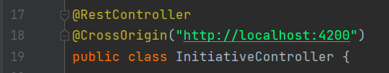

# Revature Strategic Initiatives Board

## Startup Guide

* Step 1) Clone Github Repos:
  * Backend: <https://github.com/Project3VinayBatch/Project-3-Client.git>
  * Frontend: <https://github.com/Project3VinayBatch/Project-3-Services.git>
  
* Step 2a) Configure Java Application
  * You must modify these files to your specific settings to run the app properly:
    * `src\main\resources\application.properties`
    * `src\main\resources\secret.properties`
  

  * You must also modify `@CrossOrigin` annotations on the `Controller Classes` with the address your Angular application is running from.
    * By default it is on <http://localhost:4200>
  
  

* Step 2b) Run Java Server Application
  * Within IntelliJ
    * Simply run main program `Project3ServerApplication`
  * Or by running the built Java app.
    * Do `gradle build` or `gradlew build` in terminal
    * Run Java jar.
      
* Step 3) Run Angular Application
  * Within Visual Code
    * `ng serve`
  * Or run the built single page application on S3 bucket with static web hosting.
    * `ng build` then upload to S3 bucket and get assigned a URL to access the static web page.

* Step 4) Login through GitHub and use the App
  * GitHub OAuth for the application may need to be reregistered on your end.
  
